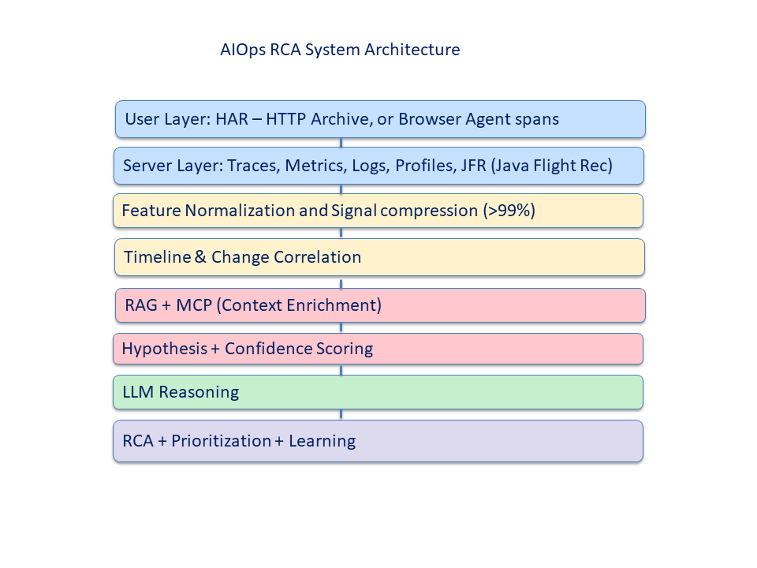

# AIOps RCA System: Evidence-Grounded, Multi-Layer Observability with LLM Reasoning

## Overview
This project demonstrates a production-oriented AIOps system that transforms high-volume observability data into actionable, explainable root cause analysis (RCA) and operational decision support.

## Key Capabilities
- Cross-layer correlation (HAR → JFR)
- >99% signal reduction (Logs 500:1, Traces 225:1)
- Feature engineering to improve ML analysis
- Evidence-grounded LLM reasoning
- RAG + MCP integration (including bugs/patches)
- Business-aware prioritization
- Closed-loop learning

## Architecture
The system correlates signals across user, service, and runtime layers, enriches context using retrieval and tools, and applies LLM reasoning to produce explainable RCA with prioritization and mitigation.

## Example RCA Output
Primary RCA: DATABASE_BOTTLENECK  
Contributing: RETRY_STORM, CONFIGURATION_REGRESSION  

Mitigation:
- Increase DB pool size  
- Reduce retry amplification  
- Pause low-priority workloads  

## Impact
- Faster RCA  
- Reduced MTTR  
- Improved operational decisions  

---

## Implementation Artifacts (Deep Dive)

These notebooks serve as **implementation artifacts supporting the system design**, rather than standalone analyses.

- [RCA.ipynb](./RCA.ipynb)  
  End-to-end AIOps RCA pipeline including:
  - Cross-layer feature normalization (HAR, traces, metrics, logs, JFR)
  - Hypothesis generation and confidence scoring
  - LLM reasoning with RAG and MCP enrichment
  - RCA output with prioritization and mitigation guidance  

- [Logs.ipynb](./Logs.ipynb)  
  Log clustering and pattern extraction:
  - Template generation and clustering
  - Noise reduction (~800:1)
  - Feature engineering for RCA  

- [Forecasting.ipynb](./Forecasting.ipynb)  
  Time-series analysis for a JVM OutOfMemory prediction:
  - Forecasting models (ARIMA/LSTM)

### 🔷 Suggested Navigation
1. Review the architecture overview above  
2. Open **RCA.ipynb** for the end-to-end system flow  
3. Explore supporting notebooks for detailed components  

---

## 🔷 Future Directions

- Agentic RCA with iterative evidence gathering  
- Real-time streaming pipeline integration  
- Automated remediation workflows  
- Production deployment architecture  

---

## 🔷 Summary

This project demonstrates a transition from:

**Reactive monitoring → Evidence-driven RCA → Intelligent operational systems**

It reflects how AI/ML and LLMs can be applied to build scalable, explainable, and business-aware observability platforms.