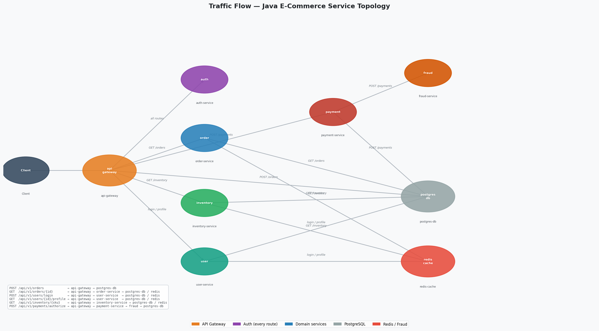

# AIOps (Artificial Intelligence for IT Operations)

## Overview

This project implements an end-to-end **AIOps pipeline** to analyze observability data using machine learning techniques.

Synthetic OpenTelemetry signals (logs, metrics, and traces) are generated to simulate a distributed Java microservices application, enabling controlled experimentation across:
* Normal operation
* Performance degradation (slowness issues)
* Failure scenarios (errors and cascading faults)

The goal is to apply ML techniques to minimize human toil:
* Identify patterns and detect anomalies
* Forecast system behavior
* Triage issues and identify the root causes of failures

For this project, OpenTelemetry signals data has been synthetically generated to simulate a typical Java-based enterprise distributed application with the topology shown in the diagram below.

## Business Understanding

### What is AIOps
"AIOps combines big data and machine learning to automate IT operations processes, including event correlation, anomaly detection and causality determination." *- Gartner*

The data for AIOps typically includes industry-standard OpenTelemetry signals (Traces, Metrics, Logs, Profiles) and other IT business data.

### Why This Matters
Modern cloud-native systems generate large volumes (petabytes of data per day) of telemetry. Traditional monitoring can show symptoms, but often leaves operators to manually correlate:
- Which log events matter
- Which metric trend is worsening
- How to triage an issue

This project shows how telemetry can be transformed into actionable operational intelligence.

## Data Analysis and ML Algorithms
This project explores three key areas:
* ➡️ Open [Logs.ipynb](Logs.ipynb) for **Log Analysis**  
Pattern discovery to group similar log messages and identify outliers (anomalies). Applied unsupervised clustering algorithms (**DBSCAN, Birch, K-Means with PCA and GridSearchCV**) with comparison, and outlier (**Isolation Forest**). Supervised classification algorithms **RandomForestClassifier, CNN, Naive Bayes, SVM** were also tried, but not included in the Project since in the real-world logs are frequently changing, and may not be pre-classifiable.
* ➡️ Open [Forecasting.ipynb](Forecasting.ipynb) for **JVM OutOfMemory Forecasting**   
Time Series forecasting using **ARIMA and LSTM** models to predict when the JVM will run out of memory.
* ➡️ Open [RCA.ipynb](RCA.ipynb) for **Root Cause Analysis and Actionability**   
Uses a unified Observability dataframe (correlated traces + metrics + logs) to analyze error and slow traces. Applied **DecisionTreeClassifier** to classify traces (normal, slow, error) and identify key contributing features. 

## Data Understanding

### Source Files
<pre>
├── data  
│    ├── simple-logs.json : simple logs for a basic app
│    ├── logs.csv : application log events  
|    |── metrics.csv : service metrics over time  
|    |── spans.csv : distributed trace spans and events  
|    |── jdbc.csv : database activity linked to traces  
|    |── profiles.csv : profiling records  
|    |── unified_features.csv : combined multi-signal feature table  
├── 1. Logs.ipynb  
│   2. Forecasting.ipynb  
|   3. RCA.ipynb  
</pre>

### Dataset Characteristics
- Domain: distributed systems / observability
- Type: multivariate synthetic telemetry data
- Signals: logs, metrics, traces, profiling, database interactions
- Scenarios: `normal`, `slow`, `error`, `security`

## Machine Learning Techniques Used
### Logs - Unsupervised Learning
- **TF-IDF**: transforms log text into weighted token features.
- **PCA**: reduces dimensionality for visualization and clustering.
- **K-Means**: centroid-based clustering of log patterns.
- **DBSCAN**: density-based clustering that can mark noise points.
- **Birch**: scalable hierarchical clustering for large log corpora.
- **Isolation Forest**: unsupervised anomaly detection for rare log events.
### Forecasting - Time-Series Models
- **ARIMA**: forecasts future values by modeling trends, seasonality
- **LSTM**: deep-learning to predict non-linear time-series 
### RCA 
- **Dummy Classifier**: As baseline to compare against Decision Tree.
- **Decision Tree Classifier**: interpretable model for trace-state classification in RCA.

### Why These Algorithms?
The project uses a mix of unsupervised, supervised, and forecasting methods because observability problems are diverse. Some tasks need pattern discovery, some need prediction, and some need explanation.

## Key Learning Insights Summary
Build the simplest possible model on the cleanest possible data, understand what each row means, engineer features that encode domain knowledge, and never confuse analytical sophistication with operational usefulness.

## Results Summary
- **Logs**: With the domain feature engineering (using tokenized_sorted_log instead of raw_log), Birch algorithm yielded the best results, successfully reducing 10,000 logs to 12 clusters!
- **Forecasting**: Both ARIMA and LTSM models were able to predict when the JVM will run out of memory.
- **RCA**: With the domain feature engineering (correlated traces, metrics and logs) Decision tree was able to correctly classify normal Vs slow Vs error traces. 

## Actionability
Summary of the key actionable tasks from the above notebooks
* Logs
- Pre-processing logs with simple regex can be a huge cost and effort saving for log analysis.
- Alerts shoud be defined to investigate log anomalies, as they could be security intrusions.
* Forecasting JVM OutOfMemory
- Optimize memory usage, increase memory limits, or periodically gracefully restart the JVM.
* RCA
- Slow traces: Optimize DB queries and improve JVM resource constraints.
- Error traces: Analyze logs for WARN/ERROR level logs.

## Future work 
* **AI Agent-driven Observability** To reduce human toil in observability. Use AI Agents to automate error and performance diagnostics, impact analysis and resolution, including using error fingerprinting and correlation with knowledge/support base for patches, runbooks, etc.
* **Gen AI (LLM) Interface** To allow users to ask questions in natural language, and provide intelligent responses based on the analyzed data.
* **OpenTelemetry signal optimization** The future of Observability will not be defined by how much telemetry data is stored, but by how intelligently systems decide what telemetry data to generate and keep. Over 90% of signal data can be unused and hence useless! Instead of petabytes of signal data generation, ingestion, storage, and analysis - intelligently reduce data at the source (Telemetry Agents) or close by (Collector) pre-ingestion by applying ML/AI based rules.

# Distributed Java Application Flow Diagram
All traffic is routed through an API Gateway, and routes calls to the appropriate backend micro-services.

