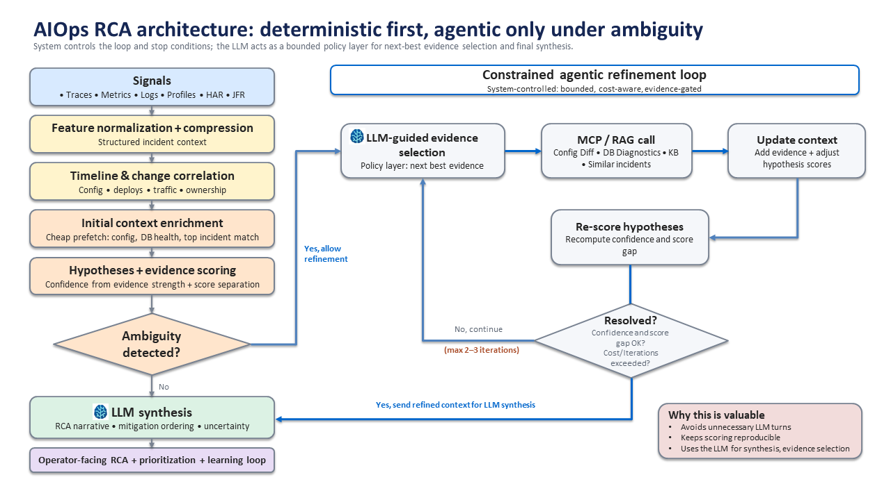

# AIOps RCA System — Deterministic + Agentic Architecture

## Overview

This project presents a **production-oriented AIOps Root Cause Analysis (RCA) system** that combines:

* deterministic, evidence-based scoring
* bounded agentic refinement
* LLM-guided reasoning (policy + synthesis)
* post-incident learning loop

The design prioritizes **correctness, explainability, and operational safety** over fully autonomous agent behavior.

---

## Design Philosophy

This system follows a **deterministic-first, agentic-second architecture**:

* **Deterministic scoring** drives hypothesis generation and confidence
* **Agentic refinement** is triggered only when ambiguity exists
* **LLM is used selectively**:

  * guided evidence selection (policy layer)
  * RCA synthesis (explanation layer)
* **System remains in control**:

  * bounded loop (max 2–3 iterations)
  * cost-aware execution
  * explicit stop conditions
* **Post-incident learning loop** improves future RCA

> This avoids common failure modes of fully agentic systems:
>
> * excessive tool calls
> * non-reproducible RCA
> * high cost and latency
> * hallucination-driven conclusions

---

## System Architecture

The diagram below shows the deterministic RCA core, bounded agentic refinement loop, LLM policy/synthesis roles, MCP tool layer, and post-incident learning feedback path.

---

## End-to-End Flow

1. Ingest multi-signal telemetry
   *(logs, metrics, traces, HAR, JFR)*

2. Normalize and correlate signals

3. Generate hypotheses with evidence-based scoring

4. Compute:

   * evidence strength
   * score separation (Δ)
   * confidence

5. Detect ambiguity

6. If ambiguous:

   * use **guided evidence selection**
   * fetch targeted context via MCP tools
   * update scores and iterate (bounded loop)

7. Generate RCA using LLM synthesis

8. Capture post-incident feedback and update system

---

## Key Architectural Concepts

### 1. Deterministic RCA Core

* Feature normalization across signals
* Hypothesis scoring using weighted evidence
* Confidence derived from:

  * evidence strength
  * score separation

---

### 2. Guided Evidence Selection (Agentic Policy Layer)

The LLM does **not explore blindly**.

Instead, it selects:

> the next piece of evidence that maximally reduces ambiguity between competing hypotheses

* maps discriminating features → tools
* selects highest-value query
* operates under system constraints

---

### 3. MCP Tool Abstraction

External systems are accessed via a structured tool layer:

#### Context & Change

* `get_deployment_history`
* `get_config_diff`
* `get_feature_flags`

#### Runtime & Topology

* `get_db_health`
* `get_service_topology`
* `get_blast_radius`

#### Knowledge & Incidents

* `retrieve_similar_incidents`
* `query_knowledge_base`
* `get_runbook`

#### Actions (controlled)

* `rollback_service`
* `toggle_feature_flag`
* `scale_service`
* `create_incident_update`

---

### 4. Bounded Agentic Loop

* Triggered only when **confidence or separation is low**
* Typically **1–2 iterations**
* Hard limits:

  * iteration count
  * cost / latency budget
  * tool access

---

### 5. LLM Role (Explicitly Constrained)

The LLM is **not used for open-ended root cause discovery**.

It is used for:

* **Policy layer**
  → guided evidence selection

* **Synthesis layer**
  → RCA narrative, mitigation, prioritization

---

### 6. Post-Incident Learning Loop

After resolution:

* compare predicted vs actual root cause
* update:

  * feature weights
  * thresholds
  * retrieval signals
* store incident for future similarity matching

This enables **continuous improvement** of RCA accuracy.

---

## Why This Approach

Compared to fully agentic systems:

* **Reduces unnecessary LLM usage**
  → lower cost and latency

* **Ensures reproducible RCA**
  → deterministic scoring

* **Improves explainability**
  → explicit evidence + confidence

* **Avoids hallucination risk**
  → LLM is not primary decision-maker

* **Enables continuous learning**
  → closed-loop feedback

> The system trades some autonomy for **control, reliability, and production readiness**.

---

## Repository Structure
The RCA system builds on foundational signal processing techniques, including log clustering and time-series anomaly detection, which transform raw telemetry into structured, high-signal inputs for hypothesis generation.

### Core RCA System
- `RCA.ipynb` → deterministic RCA pipeline (multi-signal correlation, scoring, confidence)
- `SRE-Agent-Blueprint.ipynb` → agentic refinement loop + learning system

### Supporting Signal Processing & ML

- `Logs.ipynb`  
  → log clustering, template extraction, and signal reduction  
  → transforms high-volume logs into structured patterns for RCA  

- `Forecasting.ipynb`  
  → time-series forecasting and anomaly detection  
  → identifies deviations that feed hypothesis generation  

### Artifacts
- `aiops-rca-agentic-architecture-learning-loop.svg` → system architecture diagram
---

## Key Takeaway

> This system demonstrates how to combine deterministic observability analysis with controlled agentic reasoning to achieve high-quality, explainable RCA suitable for real-world SRE environments.

---

## Future Extensions

* multi-agent orchestration
* topology-aware causal reasoning
* automated mitigation workflows
* deeper integration with CI/CD and incident systems

---
